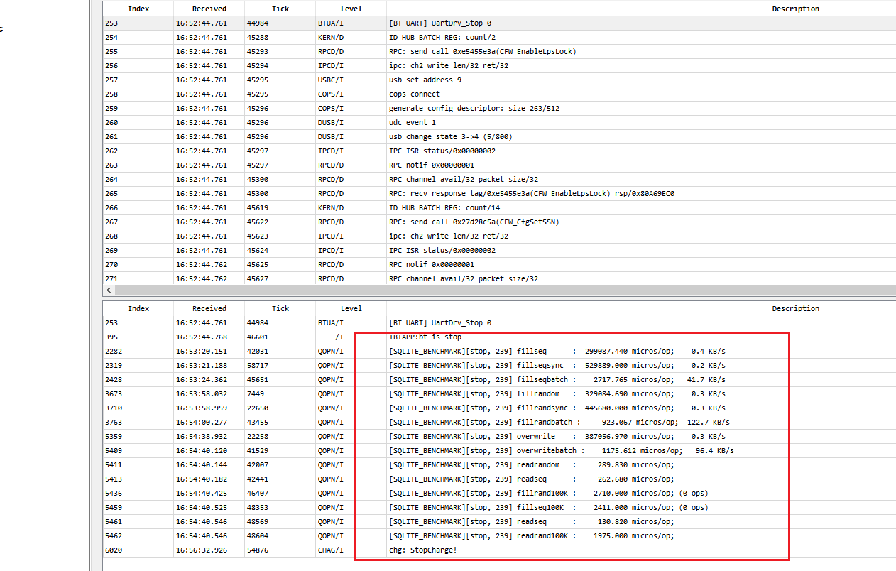
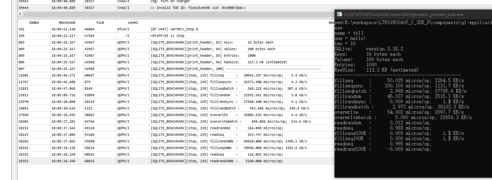
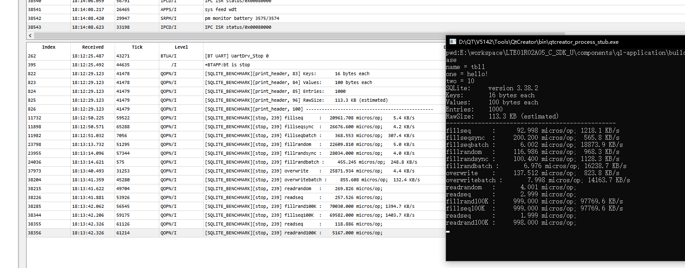

## sqlite 移植代码说明

移植的sqlite 版本是 3.38.2

目录结构：

```bat
E:.
│  .gitignore
│  CMakeLists.txt
│  config.h
│  main.c
│  shell.c
│  sqlite3.c
│  sqlite3.h
│  sqlite3382_port.pro
│  sqlite3ext.h
│  sqlite3_demo.c
│
└─port
        os_quec_rtos.c
        os_win.c
```


config.h 是编译配置

sqlite3.c 和 os_quec_rtos.c 是参与编译的数据库源码

sqlite3_demo.c 是例程


main.c、shell.c 和 os_win.c 是 windows 环境下的适配代码，去掉了原来的系统调用，编译环境使用QT，工程文件 sqlite3382_port.pro，用来调试验证。




```
FLAGS_WAL_enabled
```



```
FLAGS_WAL_disabled
```




windows

```
SQLite:     version 3.38.2
Keys:       16 bytes each
Values:     100 bytes each
Entries:    1000000
RawSize:    110.6 MB (estimated)
------------------------------------------------
fillseq      :      48.647 micros/op;    2.3 MB/s
fillseqsync  :      59.896 micros/op;    1.8 MB/s
fillseqbatch :       2.543 micros/op;   43.5 MB/s
fillrandom   :      69.527 micros/op;    1.6 MB/s
fillrandsync :      73.792 micros/op;    1.5 MB/s
fillrandbatch :      39.262 micros/op;    2.8 MB/s
overwrite    :      81.093 micros/op;    1.4 MB/s
overwritebatch :      67.556 micros/op;    1.6 MB/s
readrandom   :      17.090 micros/op;
readseq      :       9.226 micros/op;
fillrand100K :     684.756 micros/op;  139.3 MB/s
fillseq100K  :     357.854 micros/op;  266.5 MB/s
readseq      :       1.071 micros/op;
readrand100K :     104.038 micros/op;
```


## sdemmc

```
[SQLITE_BENCHMARK][print_header, 83] Keys:       16 bytes each
[SQLITE_BENCHMARK][print_header, 84] Values:     100 bytes each
[SQLITE_BENCHMARK][print_header, 85] Entries:    10000
[SQLITE_BENCHMARK][print_header, 90] RawSize:    1.1 MB (estimated)
[SQLITE_BENCHMARK][print_header, 100] ------------------------------------------------
[SQLITE_BENCHMARK][stop, 260] fillseq      :   20789.218 micros/op;    0.0 MB/s
[SQLITE_BENCHMARK][stop, 260] fillseqsync  :   27314.350 micros/op;    4.1 KB/s
[SQLITE_BENCHMARK][stop, 260] fillseqbatch :     435.871 micros/op;    0.3 MB/s
[SQLITE_BENCHMARK][stop, 260] fillrandom   :   23037.926 micros/op;    0.0 MB/s
[SQLITE_BENCHMARK][stop, 260] fillrandsync :   29932.300 micros/op;    3.8 KB/s
[SQLITE_BENCHMARK][stop, 260] fillrandbatch :    1580.524 micros/op;    0.1 MB/s
[SQLITE_BENCHMARK][stop, 260] overwrite    :   26647.519 micros/op;    0.0 MB/s
[SQLITE_BENCHMARK][stop, 260] overwritebatch :    4213.014 micros/op;    0.0 MB/s
[SQLITE_BENCHMARK][stop, 260] readrandom   :     458.730 micros/op;
[SQLITE_BENCHMARK][stop, 260] readseq      :     330.616 micros/op;
[SQLITE_BENCHMARK][stop, 260] fillrand100K :  103089.200 micros/op;  947.5 KB/s
[SQLITE_BENCHMARK][stop, 260] fillseq100K  :   77742.000 micros/op; 1256.4 KB/s
[SQLITE_BENCHMARK][stop, 260] readseq      :     104.483 micros/op;
[SQLITE_BENCHMARK][stop, 260] readrand100K :    2577.800 micros/op;
```


```
[SQLITE_BENCHMARK][print_header, 83] Keys:       16 bytes each
[SQLITE_BENCHMARK][print_header, 84] Values:     300 bytes each
[SQLITE_BENCHMARK][print_header, 85] Entries:    10000
[SQLITE_BENCHMARK][print_header, 90] RawSize:    3.0 MB (estimated)
[SQLITE_BENCHMARK][print_header, 100] ------------------------------------------------
[SQLITE_BENCHMARK][stop, 260] fillseq      :   21423.606 micros/op;    0.0 MB/s
[SQLITE_BENCHMARK][stop, 260] fillseqsync  :   28319.560 micros/op;   10.9 KB/s
[SQLITE_BENCHMARK][stop, 260] fillseqbatch :     549.688 micros/op;    0.5 MB/s
[SQLITE_BENCHMARK][stop, 260] fillrandom   :   23759.350 micros/op;    0.0 MB/s
[SQLITE_BENCHMARK][stop, 260] fillrandsync :   31382.770 micros/op;    9.8 KB/s
[SQLITE_BENCHMARK][stop, 260] fillrandbatch :    2625.611 micros/op;    0.1 MB/s
[SQLITE_BENCHMARK][stop, 260] overwrite    :   28479.869 micros/op;    0.0 MB/s
[SQLITE_BENCHMARK][stop, 260] overwritebatch :    4205.833 micros/op;    0.1 MB/s
[SQLITE_BENCHMARK][stop, 260] readrandom   :    1097.322 micros/op;
[SQLITE_BENCHMARK][stop, 260] readseq      :    1071.910 micros/op;
[SQLITE_BENCHMARK][stop, 260] fillrand100K :  107367.300 micros/op;  909.7 KB/s
[SQLITE_BENCHMARK][stop, 260] fillseq100K  :   75670.800 micros/op; 1290.7 KB/s
[SQLITE_BENCHMARK][stop, 260] readseq      :     108.869 micros/op;
[SQLITE_BENCHMARK][stop, 260] readrand100K :    2580.800 micros/op;
```


## sd 卡

```
[SQLITE_BENCHMARK][print_header, 83] Keys:       16 bytes each
[SQLITE_BENCHMARK][print_header, 84] Values:     300 bytes each
[SQLITE_BENCHMARK][print_header, 85] Entries:    10000
[SQLITE_BENCHMARK][print_header, 90] RawSize:    3.0 MB (estimated)
[SQLITE_BENCHMARK][print_header, 100] ------------------------------------------------
[SQLITE_BENCHMARK][stop, 260] fillseq      :   18950.578 micros/op;    0.0 MB/s
[SQLITE_BENCHMARK][stop, 260] fillseqsync  :   23917.770 micros/op;   12.9 KB/s
[SQLITE_BENCHMARK][stop, 260] fillseqbatch :     554.290 micros/op;    0.5 MB/s
[SQLITE_BENCHMARK][stop, 260] fillrandom   :   20882.951 micros/op;    0.0 MB/s
[SQLITE_BENCHMARK][stop, 260] fillrandsync :   26696.140 micros/op;   11.6 KB/s
[SQLITE_BENCHMARK][stop, 260] fillrandbatch :    2332.589 micros/op;    0.1 MB/s
[SQLITE_BENCHMARK][stop, 260] overwrite    :   25413.753 micros/op;    0.0 MB/s
[SQLITE_BENCHMARK][stop, 260] overwritebatch :    3899.848 micros/op;    0.1 MB/s
[SQLITE_BENCHMARK][stop, 260] readrandom   :    1320.868 micros/op;
[SQLITE_BENCHMARK][stop, 260] readseq      :    1296.873 micros/op;
[SQLITE_BENCHMARK][stop, 260] fillrand100K :   99357.900 micros/op;  983.0 KB/s
[SQLITE_BENCHMARK][stop, 260] fillseq100K  :   70560.600 micros/op; 1384.2 KB/s
[SQLITE_BENCHMARK][stop, 260] readseq      :     111.288 micros/op;
[SQLITE_BENCHMARK][stop, 260] readrand100K :    2793.800 micros/op;
```

## windows

```
SQLite:     version 3.38.2
Keys:       16 bytes each
Values:     300 bytes each
Entries:    10000
RawSize:    3.0 MB (estimated)
WARNING: Optimization is disabled: benchmarks unnecessarily slow
------------------------------------------------
fillseq      :      44.802 micros/op;    6.7 MB/s
fillseqsync  :      50.000 micros/op; 6171.9 KB/s
fillseqbatch :       4.700 micros/op;   64.1 MB/s
fillrandom   :      57.849 micros/op;    5.2 MB/s
fillrandsync :      70.000 micros/op; 4408.5 KB/s
fillrandbatch :      12.208 micros/op;   24.7 MB/s
overwrite    :      92.966 micros/op;    3.2 MB/s
overwritebatch :      32.175 micros/op;    9.4 MB/s
readrandom   :       8.587 micros/op;
readseq      :       8.100 micros/op;
fillrand100K :     503.700 micros/op; 193908.8 KB/s
fillseq100K  :     503.800 micros/op; 193870.3 KB/s
readseq      :       2.100 micros/op;
readrand100K :     100.100 micros/op;
```

